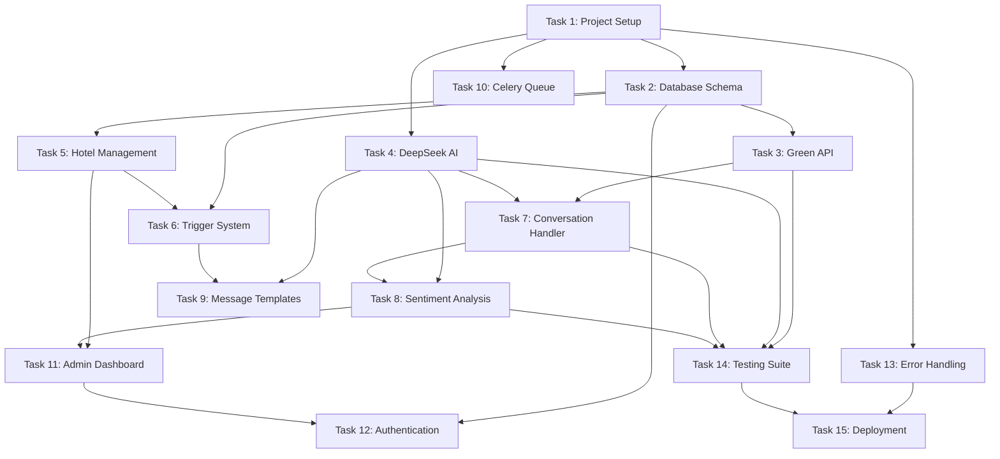

# Анализ взаимосвязей задач - WhatsApp Hotel Bot MVP

## Граф зависимостей

## Критический путь (Critical Path)

**Последовательность задач критического пути:**
1. Task 1: Project Setup (8 часов)
2. Task 2: Database Schema (12 часов) 
3. Task 3: Green API Integration (16 часов)
4. Task 7: Conversation Handler (16 часов)
5. Task 8: Sentiment Analysis (10 часов)
6. Task 14: Testing Suite (16 часов)
7. Task 15: Deployment (10 часов)

**Общее время критического пути: 88 часов (~11 рабочих дней)**

## Фазы разработки

### Фаза 1: Foundation (Основа) - 26 часов
**Параллельное выполнение:**
- Task 1: Project Setup (8 часов) 
- Task 13: Error Handling (6 часов) - может выполняться параллельно
- Task 2: Database Schema (12 часов) - после Task 1

**Результат фазы:** Готовая инфраструктура с базой данных

### Фаза 2: Core Services (Основные сервисы) - 42 часа
**Параллельное выполнение:**
- Task 3: Green API Integration (16 часов) - после Task 2
- Task 4: DeepSeek AI Integration (10 часов) - после Task 1
- Task 10: Celery Queue Setup (6 часов) - после Task 1, 2
- Task 5: Hotel Management (12 часов) - после Task 2

**Результат фазы:** Базовая функциональность отправки/получения сообщений

### Фаза 3: Business Logic (Бизнес-логика) - 50 часов
**Последовательное выполнение:**
- Task 7: Conversation Handler (16 часов) - после Task 3, 4
- Task 6: Trigger System (14 часов) - после Task 2, 5
- Task 8: Sentiment Analysis (10 часов) - после Task 4, 7
- Task 9: Message Templates (8 часов) - после Task 4, 6

**Результат фазы:** Полная бизнес-логика бота

### Фаза 4: Administration (Администрирование) - 32 часа
**Последовательное выполнение:**
- Task 11: Admin Dashboard API (12 часов) - после Task 5, 8
- Task 12: Authentication (8 часов) - после Task 2, 11
- Task 14: Testing Suite (16 часов) - после Task 3, 4, 7, 8

**Результат фазы:** Готовая система администрирования

### Фаза 5: Production (Продакшн) - 10 часов
- Task 15: Deployment (10 часов) - после Task 13, 14

## Возможности параллелизации

### Команда из 3 разработчиков:

**Developer 1 (Backend Core):**
- Task 1: Project Setup
- Task 2: Database Schema  
- Task 3: Green API Integration
- Task 7: Conversation Handler

**Developer 2 (AI & Business Logic):**
- Task 4: DeepSeek AI Integration
- Task 8: Sentiment Analysis
- Task 9: Message Templates
- Task 6: Trigger System

**Developer 3 (Infrastructure & Admin):**
- Task 10: Celery Queue Setup
- Task 13: Error Handling
- Task 5: Hotel Management
- Task 11: Admin Dashboard API
- Task 12: Authentication

**Общее время с параллелизацией: ~6-7 рабочих дней**

## Риски и блокеры

### Высокий риск:
1. **Task 3 (Green API)** - внешняя зависимость, может быть нестабильной
2. **Task 4 (DeepSeek AI)** - новый API, возможны лимиты и ошибки
3. **Task 2 (Database Schema)** - сложная multi-tenant архитектура

### Средний риск:
1. **Task 7 (Conversation Handler)** - сложная логика состояний
2. **Task 6 (Trigger System)** - требует точной настройки времени

### Стратегии митигации:
- Создать mock-сервисы для внешних API на раннем этапе
- Подготовить fallback решения для AI сервисов
- Тщательно протестировать схему БД перед началом разработки

## Milestone'ы проекта

### Milestone 1: MVP Backend (после Task 7)
- Базовая отправка/получение сообщений
- Простейший анализ настроений
- Готов для первых тестов

### Milestone 2: Business Features (после Task 9)
- Полная система триггеров
- Шаблоны сообщений
- Готов для пилотного отеля

### Milestone 3: Production Ready (после Task 15)
- Полная система администрирования
- Мониторинг и логирование
- Готов для 50+ отелей

## Рекомендации по планированию

1. **Начать с Task 1 и Task 13 параллельно** - базовая инфраструктура
2. **Приоритизировать Task 2** - от схемы БД зависит много задач
3. **Создать mock-сервисы** для Task 3 и Task 4 на раннем этапе
4. **Регулярные интеграционные тесты** после каждой фазы
5. **Еженедельные ретроспективы** для корректировки планов
